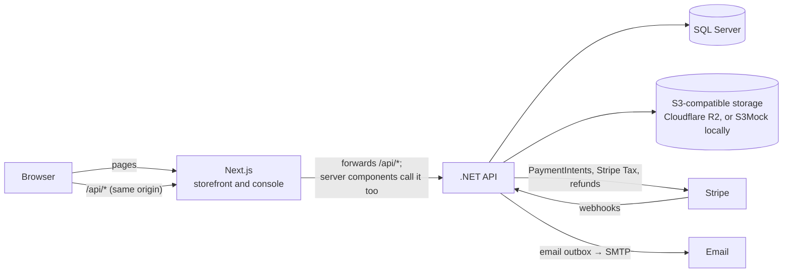
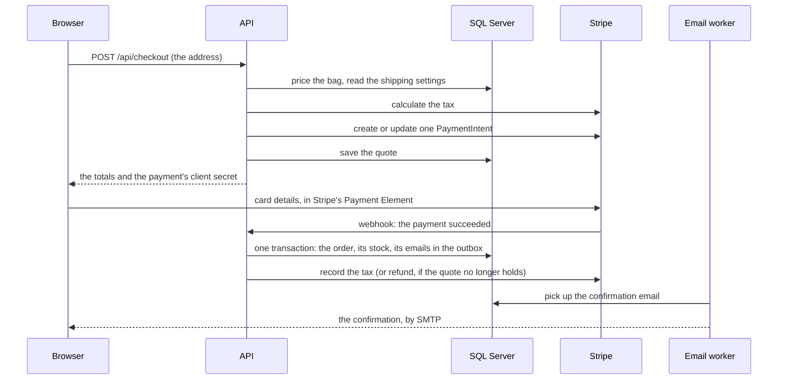
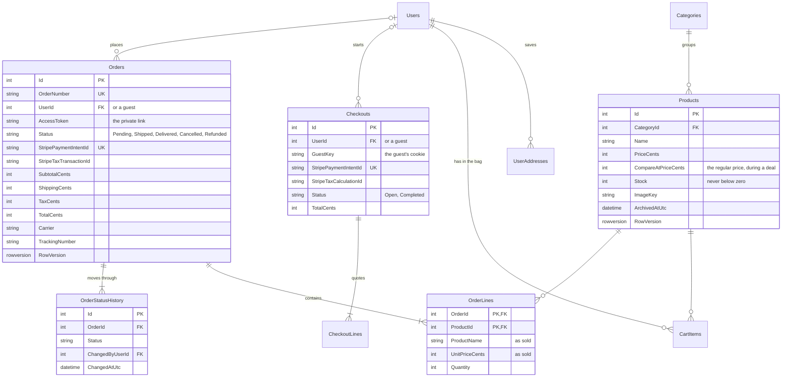

# StoreOps

StoreOps is an online store platform: a storefront for shoppers and a console for the people who run the store. Each store runs its own copy, with its own name, look, words, settings, catalog and payments, all set from the console.

**Palettehub**, a small art-supply shop, is the demo store in the screenshots. It exists only as seed data: nothing about it is written into the storefront or the console.

It's built as a production-style system rather than a template:
- a Next.js storefront and console;
- a .NET API with SQL Server;
- real Stripe payments and sales tax (in test mode);
- transactional email through an outbox;
- tests against a real database, run in CI.

| Night Studio, dark | Night Studio, light |
| --- | --- |
|  |  |

## 📋 Contents

- [Screenshots](#screenshots)
- [Features](#features)
- [Architecture](#architecture)
- [Tech stack](#tech-stack)
- [Project structure](#project-structure)
- [Running it](#running-it)
- [Testing and CI](#testing-and-ci)
- [Database schema](#database-schema)
- [Contact](#contact)
- [Acknowledgments](#acknowledgments)

## <a name="screenshots">📸 Screenshots</a>

### Shopping

| Shop | A product on sale | Search (⌘K) |
| --- | --- | --- |
|  |  |  |

### Bag, checkout and confirmation

| Bag | Payment | Confirmation |
| --- | --- | --- |
|  |  |  |

### Account

| Overview | Order tracking |
| --- | --- |
|  |  |

### On a phone

| Home | Product | Bag |
| --- | --- | --- |
|  |  |  |

### Making it your store

Theme and brand in the console: the theme switched to Atelier and the accent to ultramarine, not yet published, with the real store previewed beside the form.


| Atelier, light | Atelier, dark |
| --- | --- |
|  |  |

### The StoreOps console

| Home, light | Home, dark |
| --- | --- |
|  |  |

| Orders | Editing a product |
| --- | --- |
|  |  |

## <a name="features">🚀 Features</a>

### For shoppers

- **Browsing:**
  - Browse by category, filter by price, stock and deals, and sort.
  - Search from anywhere with ⌘K.
  - Product pages show sale prices, stock levels, and the store's own shipping and returns rules.
  - Everything about a deal (prices, badges, savings) uses one sale color, kept apart from the red of errors.
- **The bag** remembers itself before you sign in, joins your saved bag when you do, and shows how far you are from free shipping.
- **Checkout in two steps, with or without an account:**
  - First an address (and an email, for a guest), then payment with Stripe.
  - Stripe Tax works out the sales tax for the address before you pay.
  - A guest gets a private link to their order in every email about it. Find your order sends the link again, and creating an account with the same email keeps the order.
- **Your account:**
  - Every order and where it is: placed, shipped with tracking, delivered.
  - Buy again on past orders.
  - Saved addresses, with a default.
  - Password changes, and a reset by email when it's forgotten.
- **Sign-up** says how strong a new password really is ("Password1!" meets the rules and is still weak), and offers the newsletter.
- **Light and dark mode**, following the device until the shopper picks one.

### For the store (the StoreOps console)

- **Theme and brand:**
  - Pick a theme (the glowing Night Studio or the paper-and-serif Atelier), upload a logo and choose an accent color.
  - Write the home page's headline, and turn its rows on, off and around.
  - Name what the store sells ("supplies"), and fill in the About story, phone, address and social links.
  - A live preview shows the real store with the changes, on desktop or phone, light or dark, before anything is published.
- **Home:** sales for the period you pick against the one before, orders to ship, products running low, and best sellers.
- **Orders:** search and filter, and update the status with a carrier and tracking number (the customer is emailed). Cancel or refund in full through Stripe.
- **Products and categories:** prices, stock, deals, photos and archiving.
- **Customers:** their orders and addresses, and disabling an account. Who is an admin is set on the server, never from the console, so a stolen admin session can't create more admins.
- **Newsletter**, and an **activity feed** of everything that changed and who changed it.
- **Settings:** support email, flat shipping, the free-shipping threshold, the returns policy, the time zone, and whether guests can check out. The storefront reads all of it, so a change shows up on the site without a release.
- **Made for long sessions:** on wide screens, table headers stay in view while you scroll, and long forms keep their Save button on screen.

## <a name="architecture">🏗️ Architecture</a>


```mermaid
flowchart LR
    Browser -->|pages| Web["Next.js<br/>storefront and console"]
    Browser -->|"/api/* (same origin)"| Web
    Web -->|"forwards /api/*;<br/>server components call it too"| API[".NET API"]
    API --> SQL[("SQL Server")]
    API --> Images[("S3-compatible storage<br/>Cloudflare R2, or S3Mock locally")]
    API -->|"PaymentIntents, Stripe Tax, refunds"| Stripe
    Stripe -->|webhooks| API
    API -->|"email outbox → SMTP"| Mail[Email]
```

- **One origin, no tokens in JavaScript.** The browser only talks to the Next.js site, which forwards `/api/*` to the API. The API's session cookie is HttpOnly and SameSite=Lax, so it never touches client code and needs no cross-site setup.
- **The server owns every amount.** At checkout the API prices the bag, adds shipping and asks Stripe Tax for the tax, then creates one PaymentIntent for that quote. The order is created only when Stripe's webhook confirms the payment. If anything changed in between (a product sold out), the payment is refunded automatically and the customer is told why. Stock can never go negative.
- **Guest checkout without guest accounts.** A guest's checkout is theirs through a random key in an HttpOnly cookie, so going back to change the address updates the same quote and PaymentIntent. Their order gets a long random link that only its emails carry. Find your order answers the same whether or not anything matched. An order moves into an account only for an account with the order's email, holding the link.
- **Emails are never lost or sent by mistake.** An email is written to an outbox table in the same database transaction as the change that caused it, then sent and retried by a background worker.
- **Security by default:**
  - Every endpoint needs a signed-in user unless it's marked otherwise, and admin endpoints need the admin role.
  - Admin accounts run the store and can't buy from it, so their orders never mix with customers' (they test checkout as a guest).
  - Sign-in, sign-up and the public forms are rate limited, and repeated wrong passwords lock the account for a while.
  - Sign-in answers a wrong password and an unknown email the same way and in the same time. Password reset answers the same whether or not the email has an account.
  - Password reset links are single-use and short-lived, and using one signs out every session.
  - The API refuses to start with live Stripe keys.
- **Money in whole cents, history kept.** Prices and totals are integers in cents. Orders keep their status history, and an activity log records who changed what in the console.
- **A design system in tokens.** Colors, fonts, field sizes and button shapes are CSS variables with light and dark values. The storefront's themes and the console (StoreOps cobalt, compact controls) share the same components and differ only by tokens.
- **Any brand color stays readable.** A store picks one accent color. StoreOps keeps its hue and adjusts only its lightness (in OKLCH) until text in it passes WCAG contrast on that theme's pages, in light and dark mode, and builds the glows and tints around it. The console shows the shades it will use and their contrast ratios.
- **The preview is the real store.** The console's preview frame loads the actual storefront with the unsaved values in its address. The server applies them only for an admin, after validating them, so there's no second copy of the pages to drift out of date.
- **Accessible on purpose.** The target is WCAG 2.2 AA. Each page was checked with axe in light and dark mode on desktop and phone, contrast was measured rather than eyeballed, and search, menus and forms work by keyboard and screen reader.

How a bag becomes an order:


```mermaid
sequenceDiagram
    participant Shopper as Browser
    participant API
    participant DB as SQL Server
    participant Stripe
    participant Worker as Email worker
    Shopper->>API: POST /api/checkout (the address)
    API->>DB: price the bag, read the shipping settings
    API->>Stripe: calculate the tax
    API->>Stripe: create or update one PaymentIntent
    API->>DB: save the quote
    API-->>Shopper: the totals and the payment's client secret
    Shopper->>Stripe: card details, in Stripe's Payment Element
    Stripe->>API: webhook: the payment succeeded
    API->>DB: one transaction: the order, its stock, its emails in the outbox
    API->>Stripe: record the tax (or refund, if the quote no longer holds)
    Worker->>DB: pick up the confirmation email
    Worker-->>Shopper: the confirmation, by SMTP
```

## <a name="tech-stack">⚙️ Tech stack</a>

| Part | Built with |
| --- | --- |
| Web | Next.js (App Router, Server Components), React, TypeScript, Tailwind CSS, Radix UI, react-hook-form with Zod, openapi-fetch with types generated from the API's OpenAPI contract |
| API | ASP.NET Core controllers, EF Core with SQL Server, ASP.NET Core Identity (cookie sessions), Stripe.net, MailKit with Razor email templates, the AWS SDK for S3-compatible image storage |
| Tests | xUnit with Testcontainers (a real SQL Server and an S3 mock per run), Vitest, Playwright |
| Local stack | Docker Compose: SQL Server, S3Mock, Mailpit |
| CI | GitHub Actions |

## <a name="project-structure">🗂️ Project structure</a>

```text
api/
  StoreOps.Api/         The API, one folder per feature (Auth, Catalog, Cart, Checkouts, Orders, Emails, ...)
  StoreOps.Api.Tests/   Integration tests, each feature through HTTP against a real database
web/
  app/                  Routes: (root) the storefront, (checkout), (auth) sign-in, (admin) the console
  components/           UI by feature, plus the shared ui/ primitives
  lib/                  The API client and its types, data loading, formatting and other small helpers
  tests/unit/           Vitest
  tests/e2e/            Playwright
docs/screenshots/       The images in this README
docker-compose.yml      The local stack
```

## <a name="running-it">🛠️ Running it</a>

### What you need

- [Docker](https://www.docker.com/). Microsoft publishes SQL Server for Intel only, so on Apple silicon first turn on "Use Rosetta for x86_64/amd64 emulation on Apple Silicon" in Docker Desktop's settings; without it, SQL Server crashes on startup.
- The [.NET SDK](https://dotnet.microsoft.com/download) version named in `api/global.json`, and [Node.js](https://nodejs.org/) at the version in `web/.nvmrc`.
- For payments: a [Stripe](https://stripe.com) account in test mode, with Stripe Tax turned on, and the [Stripe CLI](https://docs.stripe.com/stripe-cli).

Then clone the repository: `git clone https://github.com/tomyRomero/StoreOperations`

### 1. The database, image storage and mail catcher

```bash
cp .env.example .env   # then set STOREOPS_SQL_PASSWORD
docker compose up -d   # SQL Server on 14330, S3Mock on 9090, Mailpit on http://localhost:8025
```

Every port is bound to your computer only.

### 2. The API

Secrets stay out of the repository, in .NET [user-secrets](https://learn.microsoft.com/aspnet/core/security/app-secrets):

```bash
cd api
dotnet user-secrets set "ConnectionStrings:Database" \
  "Server=localhost,14330;Database=Palettehub;User Id=sa;Password=<your password>;TrustServerCertificate=True" \
  --project StoreOps.Api
dotnet user-secrets set "Stripe:SecretKey" "sk_test_..." --project StoreOps.Api
dotnet user-secrets set "Stripe:WebhookSecret" "whsec_..." --project StoreOps.Api

dotnet run --project StoreOps.Api -- seed                 # creates the demo store
dotnet run --project StoreOps.Api --launch-profile http   # http://localhost:5200
```

The seed rebuilds the database from scratch. To keep your data after pulling a change to the schema, run `dotnet ef database update --project StoreOps.Api` instead.

In another terminal, forward Stripe's webhooks to the API. Without this, a paid order waits on "processing" forever. `stripe listen` prints the webhook signing secret: it's the `whsec_...` that goes in `Stripe:WebhookSecret` above, and it stays the same each time.

```bash
stripe login   # once
stripe listen --forward-to localhost:5200/api/stripe/webhook
```

**Images** go to S3Mock out of the box. To keep them in Cloudflare R2 (or any S3-compatible bucket) instead, give the API the bucket's details:

```bash
dotnet user-secrets set "Storage:ServiceUrl" "https://<account id>.r2.cloudflarestorage.com" --project StoreOps.Api
dotnet user-secrets set "Storage:Bucket" "<bucket name>" --project StoreOps.Api
dotnet user-secrets set "Storage:AccessKey" "<access key ID>" --project StoreOps.Api
dotnet user-secrets set "Storage:SecretKey" "<secret access key>" --project StoreOps.Api
```

### 3. The web app

```bash
cd web
cp .env.example .env.local   # then set NEXT_PUBLIC_STRIPE_PUBLISHABLE_KEY=pk_test_...
npm ci
npm run dev                  # http://localhost:3200
```

### Trying it

The seed creates two accounts, `customer@example.test` and `admin@example.test`, both with the password `Demo-Pass-123!` (local demo data only). The admin opens the console at `/admin`.

Pay with Stripe's test card `4242 4242 4242 4242`, any future date and any three digits. Every email the store sends shows up in Mailpit.

To give an account admin rights, or take them away, run this from `api/`:

```bash
dotnet run --project StoreOps.Api -- make-admin someone@example.com     # or remove-admin
```

## <a name="testing-and-ci">✅ Testing and CI</a>

- **API:** `cd api && dotnet format --verify-no-changes && dotnet test`.
  - Each feature runs through HTTP against a real SQL Server in a container: checkout and webhooks (with a fake Stripe), refunds, the email outbox, rate limits and lockouts, and the rules the database enforces on its own.
  - A check over every route the app has: admin routes need an admin, and only a short, named list is open to visitors.
  - A check that the web app's copy of the API contract is up to date.
- **Web:** `cd web && npm run lint && npm run typecheck && npm test`. ESLint, TypeScript, and Vitest for the logic behind the pages: money and dates in the store's time zone, brand-color contrast, filters, password strength, and how the API's errors reach the forms.
- **End to end:** Playwright drives the whole store in Chromium, paying with Stripe's test card and reading the emails in Mailpit:
  - a guest's checkout, and getting back to the order;
  - a new customer's checkout, and keeping a guest order in a new account;
  - an admin shipping an order (the guest gets the tracking by email), adding a product with a photo, and a newsletter reaching a new subscriber;
  - a password reset from the emailed link.

  Start the store first as in [Running it](#running-it), with the webhook relay, then:

  ```bash
  cd web
  npx playwright install chromium   # once
  npm run e2e
  ```

On every pull request and every push to `main`, GitHub Actions:
- lints, typechecks, tests and builds the web app, and checks its API types match the committed contract;
- checks the API's formatting, then builds and tests it against a real SQL Server.

## <a name="database-schema">📊 Database schema</a>


```mermaid
erDiagram
    Users ||--o{ UserAddresses : saves
    Users ||--o{ CartItems : "has in the bag"
    Users |o--o{ Checkouts : starts
    Users |o--o{ Orders : places
    Categories ||--o{ Products : groups
    Products ||--o{ CartItems : ""
    Checkouts ||--|{ CheckoutLines : quotes
    Orders ||--|{ OrderLines : contains
    Orders ||--|{ OrderStatusHistory : "moves through"
    Products ||--o{ OrderLines : ""

    Products {
        int Id PK
        int CategoryId FK
        string Name
        int PriceCents
        int CompareAtPriceCents "the regular price, during a deal"
        int Stock "never below zero"
        string ImageKey
        datetime ArchivedAtUtc
        rowversion RowVersion
    }
    Checkouts {
        int Id PK
        int UserId FK "or a guest"
        string GuestKey "the guest's cookie"
        string StripePaymentIntentId UK
        string StripeTaxCalculationId
        string Status "Open, Completed"
        int TotalCents
    }
    Orders {
        int Id PK
        string OrderNumber UK
        int UserId FK "or a guest"
        string AccessToken "the private link"
        string Status "Pending, Shipped, Delivered, Cancelled, Refunded"
        string StripePaymentIntentId UK
        string StripeTaxTransactionId
        int SubtotalCents
        int ShippingCents
        int TaxCents
        int TotalCents
        string Carrier
        string TrackingNumber
        rowversion RowVersion
    }
    OrderLines {
        int OrderId PK, FK
        int ProductId PK, FK
        string ProductName "as sold"
        int UnitPriceCents "as sold"
        int Quantity
    }
    OrderStatusHistory {
        int Id PK
        int OrderId FK
        string Status
        int ChangedByUserId FK
        datetime ChangedAtUtc
    }
```

- **A checkout is the priced quote behind one Stripe PaymentIntent.** The webhook turns it into an order, matched by that PaymentIntent. It's unique, so a retried webhook can't create a second order.
- **Every order is reachable.** Checkouts and orders belong to an account or to a guest, and the database refuses an order that neither an account nor a private link can reach.
- **Order lines keep the name and price as sold**, so later edits to a product never change a past order.
- **Alongside these:**
  - store settings, a single row that the database keeps single;
  - the activity log;
  - newsletter subscribers;
  - the email outbox;
  - the keys that encrypt session cookies, so sign-ins survive restarts.

The schema is created and changed by EF Core migrations.

## <a name="contact">📫 Contact</a>

Made by Tomy F. Romero. Questions about the project are welcome at tomyfletcher99@hotmail.com.

© 2024–2026 Tomy F. Romero. All rights reserved. The code is public to read, but isn't licensed for reuse; see [LICENSE](LICENSE).

[](https://www.linkedin.com/in/tomyromero/)
[](https://tomyromero.vercel.app)

## <a name="acknowledgments">🙌 Acknowledgments</a>

- [Stripe](https://stripe.com) for payments and sales tax, in test mode.
- [Radix UI](https://www.radix-ui.com) for accessible dialogs, menus and selects, and [Lucide](https://lucide.dev) for the icons.
- [Geist, Geist Mono](https://vercel.com/font) and [Instrument Serif](https://fonts.google.com/specimen/Instrument+Serif) from Google Fonts.
- [Testcontainers](https://testcontainers.com), [S3Mock](https://github.com/adobe/S3Mock) and [Mailpit](https://mailpit.axllent.org) for testing against the real thing.
