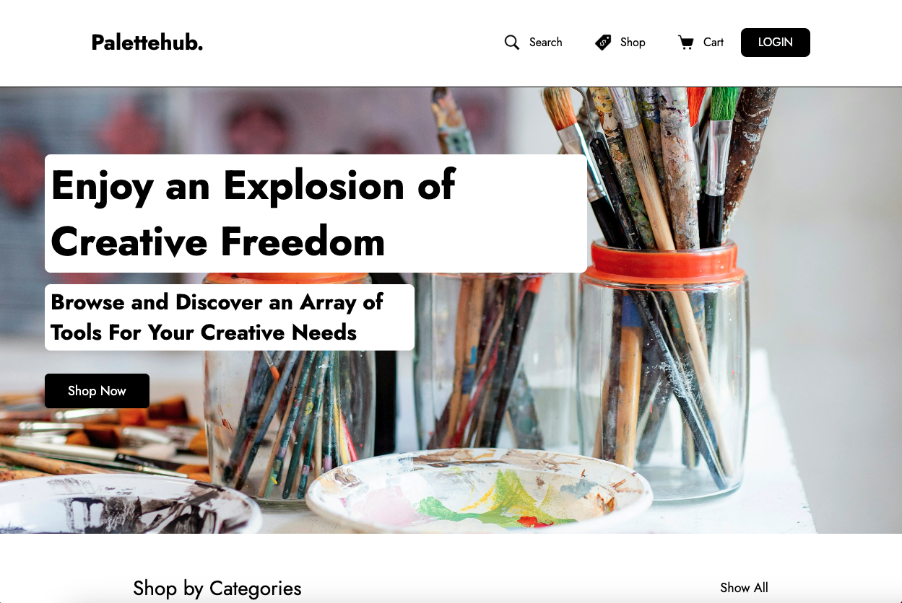
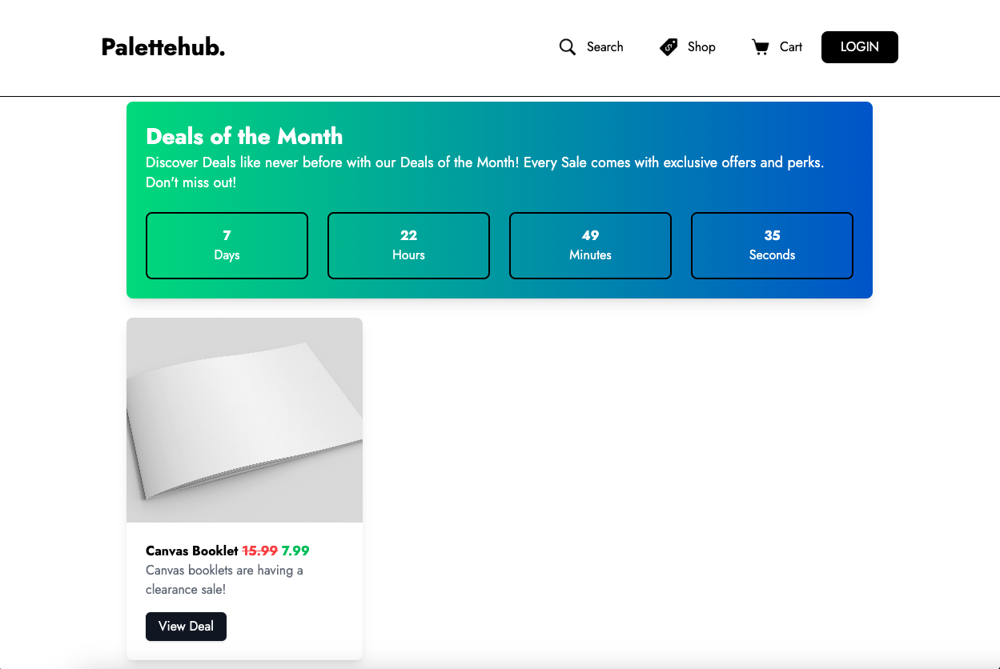
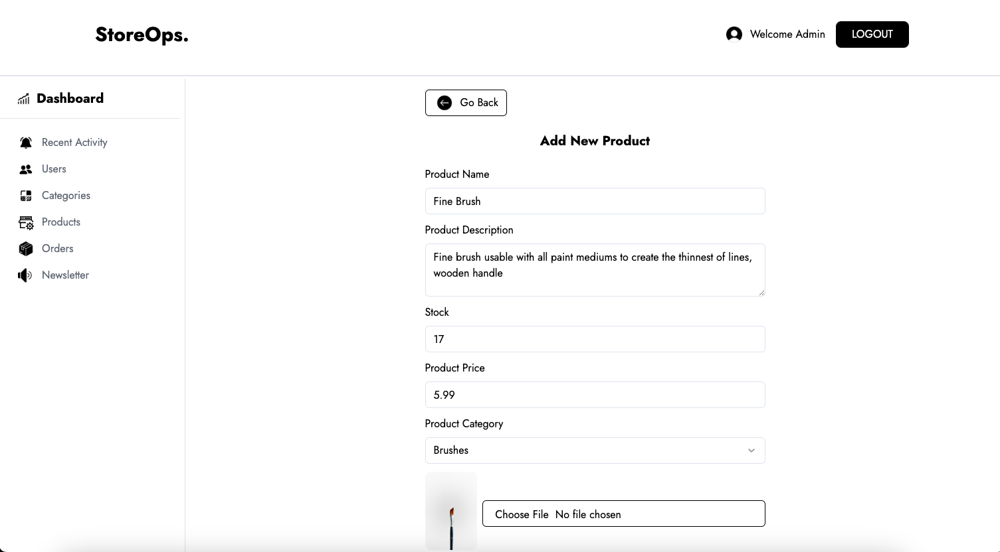

# StoreOps - E-Commerce Portfolio Project

## 📋 Table of Contents

1. [Overview](#overview) 🌐
2. [Technologies Used](#technologies) ⚙️
3. [Features](#features) 🚀
4. [Live Site](#live) 📦
5. [Contact](#contact) 📫
6. [Database Schema](#database-schema) 📊
7. [Screenshots](#screenshots) 📸
8. [Admin Panel Screenshots](#admin-panel) 🔧
9. [Acknowledgments](#acknowledgments) 🙌
10. [Future Updates](#updates)  🚀 
11. [Project Status](#status) 📊
12. [Setup](#setup) ⚙️


## <a name="overview">🌐 Overview </a>

StoreOps is a full-stack E-Commerce Platform designed to provide a seamless online shopping experience for users. With robust features that you would expect in an E-Commerce platform, StoreOps comes with a customer experience and an admin experience.

## <a name="technologies">⚙️ Technologies Used </a>

- Frontend: [React](https://reactjs.org/), [Tailwind CSS](https://tailwindcss.com/), [React Hook Forms](https://react-hook-form.com/), [Zod](https://zod.dev/), [Stripe](https://stripe.com/), [Shadcn](https://ui.shadcn.com/)
  
  
  
  
  
  

- Backend: [Next.js](https://nextjs.org/), [MongoDB Atlas](https://www.mongodb.com/cloud/atlas), [AWS S3](https://aws.amazon.com/s3/), [Nodemailer](https://nodemailer.com/), [NextAuth.js](https://next-auth.js.org/), [bcrypt](https://www.npmjs.com/package/bcrypt)
  
  
  
  
  
  


- Payment Processing: [Stripe](https://stripe.com/)
  

## <a name="features">🚀 Features</a>

## Project Features

- **Product Management**: Browse, search, and purchase products with ease. Administrators have full control to edit, add, or delete products based on business needs. Products come with stock management capabilities, ensuring seamless reflection of stock changes in the store. Admins can also create deals for products and more.

- **Category Management**: Easily browse, filter, and associate products to categories. Admins have the authority to manage categories by editing, adding, or deleting them as needed.

- **Cart**: Seamlessly add items to your cart, and resume your shopping experience right where you left off. The cart functionality is powered by local storage and a cart database schema, ensuring synchronization once a user creates or logs into an account. Real-time dynamic calculations ensure accurate subtotals, and users are promptly notified if a product is out of stock or if the desired quantity exceeds availability.

- **User Authentication**: Secure login and registration are facilitated through NextAuth.js and MongoDB database integration. The sign-up form, fortified with bcrypt encryption, ensures password security. Additionally, a dedicated admin account grants special permissions and access to an exclusive interface. Users can securely change their passwords at any time.

- **Payment Processing**: Integration with Stripe ensures seamless transactions. Products are registered through Stripe, including archiving of deleted products. The checkout and address forms leverage Stripe's security features, while tax calculations are dynamically adjusted based on user addresses.

 - For testing Stripe purchases, you can use the following test card details:
    - Card number: 4242 4242 4242 4242
    - Expiration date: Any future date
    - CVC: Any

- **Webhooks**: Utilization of Stripe webhooks enables automated order recording, email notifications to customers and admins, real-time stock updates, cart clearance, and more.

- **Order Management**: Users can view order history and track order status, while admins can update order statuses to keep customers informed of order progress.

- **Responsive Design**: The platform is optimized for various devices and screen sizes, ensuring a consistent user experience across platforms.

- **Image Storage System**: AWS S3 is employed for storing and serving product images, enabling administrators to upload and edit products and categories from anywhere, without the need to manage image storage locally.

- **Database Management**: MongoDB Atlas is utilized to store and manage data, including carts, addresses, users, products, categories, activity logs, orders, and newsletter subscribers.

- **Admin Panel**: Administrators can manage products, orders, and user accounts with ease, leveraging features such as pagination and search functionalities. Dedicated sections for recent activity and newsletter updates ensure administrators stay informed and connected with users.

- **Search Functionality and Pagination**: Robust search functionality and pagination facilitate quick access to desired products and other date such as orders, ensuring fast performance and efficient navigation.

- **Security**: Multiple security measures are implemented, including encoded HTML to prevent XSS attacks, server-side data validation, strict password parameters to thwart brute force attacks, and HTML sanitization to prevent potential injection attacks.

- **Email System**: A comprehensive email system is in place for sending alerts to admins and customers, including notifications for account creation, order placement, and customer support requests. Newsletter functionality enables visitors to subscribe and receive updates on store activities.

- **Input Validation**: Utilizes Zod resolver and React Hook Forms for input validation, ensuring data integrity and preventing invalid data submission.

## <a name="live"> 📦 Live Deployment </a>
The StoreOps platform is live and accessible at [palettehub.vercel.app](https://palettehub.vercel.app/). StoreOps was created with the default theme of an art supply store to demonstrate the functionalities but can be fully customized to reflect any type of supply business. For those interested in exploring the admin panel, kindly reach out to me, specifying your purpose, and I'll gladly provide the necessary login credentials.

## <a name="contact" > 📫 Contact </a>
For inquiries or further information, please contact me at tomyflecther99@hotmail.com, or reach out to me at [](https://www.linkedin.com/in/tomy-romero-902476145/)

## <a name="database-schema"> 📊 Data Base Schema </a>


###  📊 Database Relationships
- **User and Order Relationship**: One-to-Many relationship.
- **Cart and User Relationship**: One-to-One relationship.
- **User and Address Relationship**: Many-to-Many relationship.


## <a name="screenshots"> 📸 Screenshots Customer Side</a>

User interface and different functionalities of StoreOps.

### Home



### Promotion


### Footer


### Products 


### Product Details


### Cart


### Checkout


### Sign Up 


### Login


### Address 


### Order Success


### Search


### Account


### Orders


### Email


### Addresses


### Policy 


## <a name="admin-panel"> 🔧 Screenshots Admin Panel </a>

The Admin Panel provides administrators with functionalities for managing products, orders, and user accounts.

### Activity


### Users


### Categories


### Products 




### Orders


### Newsletter


## <a name="updates">🚀 Future Updates</a>
Looking ahead, there are some cool ideas brewing to make StoreOps better:

- **Saved Payments**: Give users the option to save their payment methods for faster checkouts. This would require more security. 

- **Enhanced Store Design**: Explore additional options to allow store owners to further personalize the online storefront. From custom themes to advanced branding options, giving businesses more control over their digital presence..

- **Business Protocol Integration**: Ensure everything is under policy and suitable for an actual thriving business.

## <a name="acknowledgments"> 🙌 Acknowledgments</a>
Special thanks to [Stripe](https://stripe.com/) for providing a reliable payment processing solution, 
Shout out to https://unsplash.com/ for all the pictures that were not user submitted.
Shout out to https://icons8.com/ for all provided icons. 

## <a name="status">📊 Project Status</a>
The project is currently in Stripe test mode, but all functionalities are fully operational. The business logic is the only aspect that requires adjustments.

## Setup

### .env.example is provided to follow on what keys the project needs

```bash
# Clone the repository
git clone https://github.com/tomyRomero/storeOps

# Navigate to the project directory
cd storeOps

# Install dependencies
npm install

# Start the development server
npm run dev
